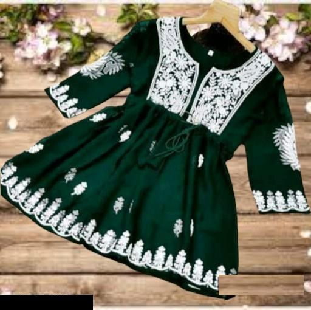
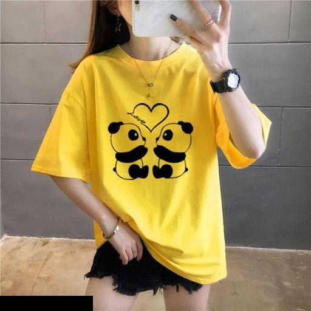
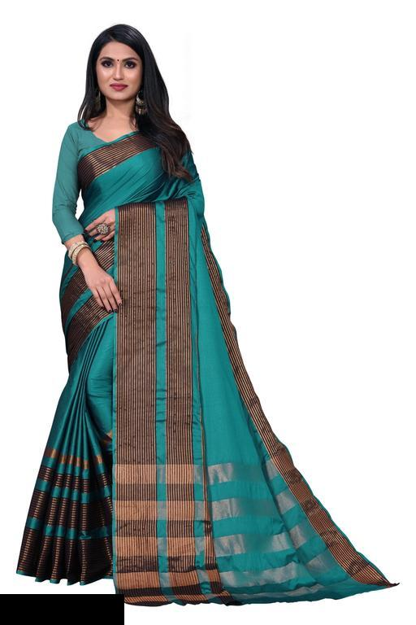
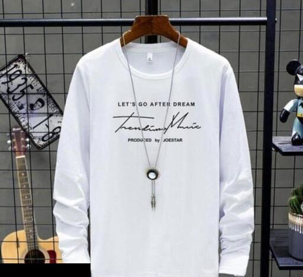
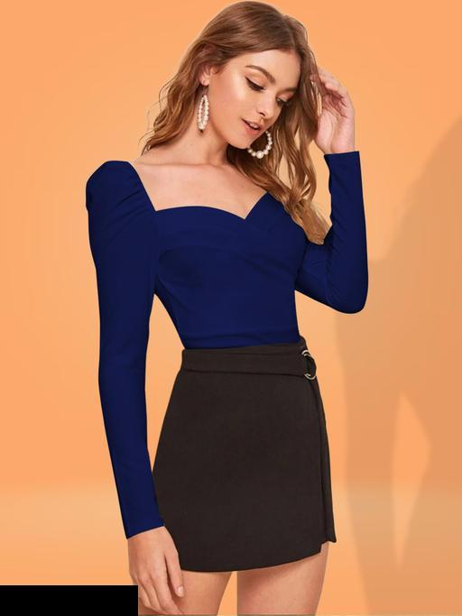

# 🌟 **Multi-Output Attribute Classification for Visual Taxonomy** 🌟

Welcome to the **Multi-Attribute Classification Project**! This repository contains three notebooks for categorizing various attributes of *Kurtis*, *Women's T-Shirts*, and *Sarees*. Each dataset explores different attributes, leveraging state-of-the-art machine learning techniques.

---

## **Overview**

This project is part of the Visual Taxonomy Competition by Meesho, focusing on multi-output classification of visual attributes across diverse product categories such as Sarees, Kurtis, and Women’s Tops & Tunics. The goal is to accurately predict multiple attributes for each category using advanced feature extraction techniques, cutting-edge machine learning models, and ensemble methods.

---
## **Datasets**
- **Train Dataset**: Contains images of products along with their respective attribute labels.
- **Test Dataset**: Contains images of products for which attributes need to be predicted.

## 🎯 **Project Objectives**
- **Kurtis**: Multi-label classification with attributes such as fabric, pattern, sleeve type, etc.
- **Women's T-Shirts**: Predict pattern, sleeve length, and multicolor attributes.
- **Sarees**: Classify attributes like color, fabric, border type, and more.
- **Mens Tshirts**: Predict attributes like sleeve length, colar type, color,etc.
- **Women Tops & Tunics**: Predict attributes like color, occasion, fabric,etc.

---

## 📂 **Files in this Repository**
| File Name         | Description                                  |
|--------------------|----------------------------------------------|
| `Kurtis.ipynb`    | Notebook for Kurtis attribute classification. |
| `Women_tshirts.ipynb` | Notebook for Women's T-Shirts attribute classification. |
| `Sarees.ipynb`    | Notebook for Sarees attribute classification. |
| `Women_tops.ipynb` | Notebook for Women Tops & Tunics attribute classification. |
| `men_tshirts.ipynb` | Notebook for men's T-Shirts attribute classification. |

---

## 🚀 **Modeling Approach**
**1. Initial Experiments with ResNet50**

- **Feature Extraction and Prediction:**

  - Utilized ResNet50 pre-trained on ImageNet for feature extraction.
  - Built separate models for each attribute, resulting in independent predictions.

- **Observation:** While ResNet50 provided a solid baseline, the results varied significantly across attributes and categories.


**2. Model Experiments with Random Forest and CatBoost**

Extracted features using ResNet50 and trained Random Forest and CatBoost classifiers for prediction.

**Notable Results:**

- **Sarees attr_4**: Achieved better performance using Random Forest.

- **Other Attributes**: CatBoost outperformed Random Forest in several cases.


**3. Incorporation of ViTs and VGG16**

Experimented with Vision Transformers (ViTs) and VGG16 for feature extraction:

- **ViTs**: Showed moderate improvement but were computationally expensive.

- **VGG16**: Delivered the best results overall for feature extraction, particularly in color-related attributes.


**4. Color Quantization for Color Attributes**

- **Technique**: Used K-Means clustering to extract dominant colors from images with 3 clusters.

- **Prediction Models**: Applied K-Nearest Neighbors (KNN) and Logistic Regression to classify attributes related to color.

- **Outcome**: Achieved competitive results for color-related attributes using this approach.


**5. Ensemble Techniques**

Applied stacking and weighted voting to enhance predictions:

- **Stacking**: Combined predictions from multiple models using a meta-classifier.

- **Weighted Voting**: Aggregated predictions with weights assigned based on model performance.

---

## 🎨 **Visual Enhancements**

### **Example Images**
#### Kurtis


#### Women's T-Shirts


#### Sarees


#### Men's T-Shirts


#### Women's Tops & Tunics


---

## 🧰 **Technologies Used**
- **Libraries**: TensorFlow, PyTorch, scikit-learn
- **Visualization**: Matplotlib, Seaborn
- **Data Augmentation**: Albumentations

---

## 📊 **Performance Metrics**
**Resnet50**:
| Dataset         | Accuracy  | Loss   |
|-----------------|-----------|--------|
| Kurtis          | 70.4%     | 0.12   |
| Women's T-Shirts | 81.6%     | 0.09   |
| Men's T-shirts          | 97.6%     | 0.12   |
| Women's Tops & Tunics          | 82.3%     | 0.08   |
| Sarees          | 62.5%     | 1.08   |

**VGG16 Multi-class Multi-label classification**:
- **Accuracy**: 76%
- **F1 Score**: 0.73

---

## 💡 **How to Use**
1. Clone this repository:
   ```bash
   git clone https://github.com/yourusername/fashion-attribute-classification.git
   ```
2. Open the relevant `.ipynb` file in Jupyter Notebook or Google Colab.
3. Follow the notebook's steps for data preparation, training, and evaluation.

---

## 📩 **Contact**
- Email: `yourname@example.com`
- GitHub: [YourUsername](https://github.com/PRAK-HARS)
- LinkedIn: [YourLinkedIn](https://www.linkedin.com/in/prakhar-singh-a6a60321b/)

---
